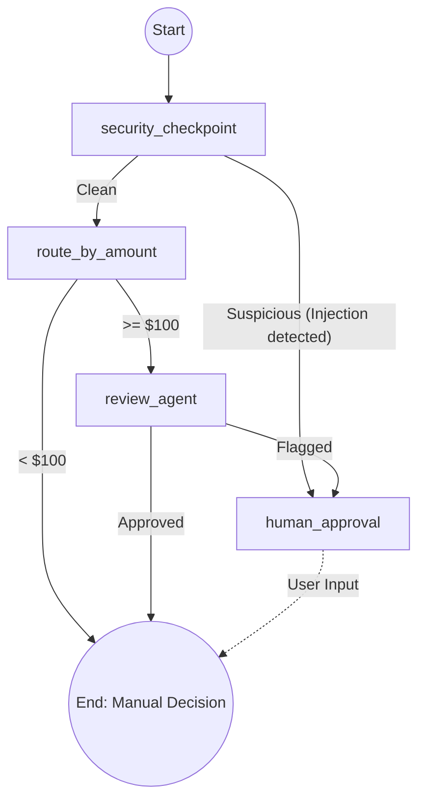

# System Architecture

The Ambient Expense Approval Agent is built on the **Google Agent Development Kit (ADK) 2.0**. It utilizes the new **Graph Workflow API** to process, route, and evaluate expense reports in a deterministic, state-driven manner.

## Core Concepts

The system models the expense approval process as a directed graph where:
- **Nodes** represent discrete operations or checkpoints (e.g., security scrubbing, LLM review).
- **Edges** represent the routing logic based on the outcome of a node.
- **State** is a shared data structure (`ExpenseState`) passed along the nodes containing the expense data and evaluation context.

## State Management

The shared state passed through the graph is defined by the `ExpenseState` object:
- `expense`: The core data model (`amount`, `submitter`, `category`, `description`, `date`).
- `security_flag`: A boolean indicating if the input triggered a security warning.
- `llm_decision`: The outcome of the LLM review (`APPROVED` or `FLAGGED`).
- `human_decision`: The final decision from the human-in-the-loop (if required).
- `final_status`: The ultimate outcome of the workflow (`APPROVED`, `REJECTED`, or `FLAGGED`).

## Graph Nodes & Workflow

1. **`__start__`**  
   The entry point. Receives the JSON payload, instantiates the `ExpenseState`, and routes to the `security_checkpoint`.

2. **`security_checkpoint` (Node)**  
   Acts as a gateway to protect downstream nodes.
   - **Action:** Scrubs the description for PII (SSNs, Credit Cards) and detects prompt injection attempts.
   - **Routing:** 
     - If clean: Proceeds to `route_by_amount`.
     - If suspicious: Sets `security_flag = True` and routes directly to `human_approval`, bypassing the LLM.

3. **`route_by_amount` (Node)**  
   Implements the fast-path deterministic logic.
   - **Action:** Evaluates the dollar amount against the configured `APPROVAL_THRESHOLD` (default: $100).
   - **Routing:**
     - Under threshold: Routes to `__end__` (auto-approved).
     - Over/Equal to threshold: Routes to the `review_agent`.

4. **`review_agent` (Node)**  
   The intelligent review step powered by the `gemini-3.1-flash-lite` model.
   - **Action:** Evaluates the scrubbed expense data against company policy for risk factors.
   - **Routing:**
     - If the LLM approves: Routes to `__end__`.
     - If the LLM flags the expense: Routes to `human_approval`.

5. **`human_approval` (Node)**  
   The Human-In-The-Loop (HITL) step.
   - **Action:** Utilizes ADK's `RequestInput` to pause graph execution and await explicit human action via the Playground UI.
   - **Routing:** Once input is received (approve/reject), the graph proceeds to `__end__`.

## Workflow Diagram

## Infrastructure & Configuration
- **Model Config**: Managed in `config.py`. Threshold values and model variants are decoupled from the graph definition.
- **Observability**: Inherits ADK's built-in telemetry, allowing graph executions, transitions, and LLM traces to be viewed in the ADK CLI playground.
